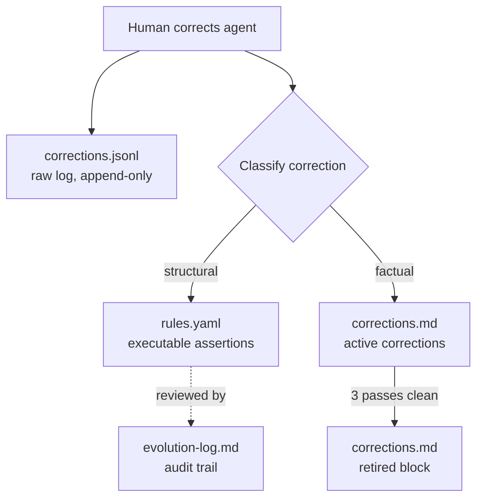
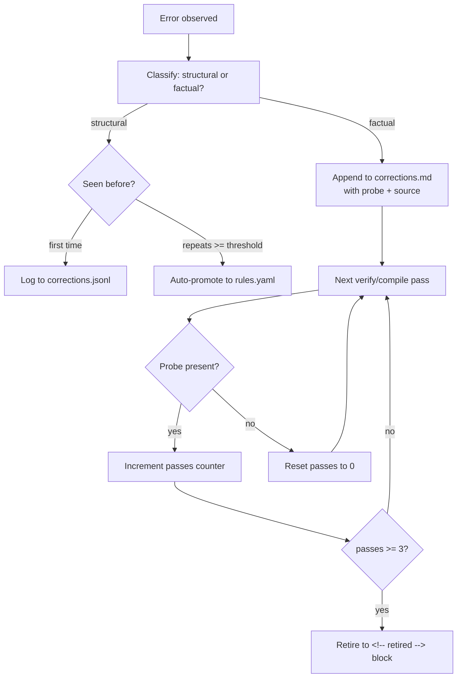

# Agent Memory and Learning

The LLM agent learns from corrections across sessions through structured, read-only rules and tracked factual corrections. Rules are executable assertions the agent reads but never modifies. Corrections retire automatically after the agent demonstrates it has internalized the fix.

## Context

LLM agents are stateless across sessions — corrections given in one conversation are lost in the next. Early attempts to persist corrections used freeform markdown (a `learned-rules.md` file), but the agent would rewrite, soften, or remove rules it disagreed with at runtime. Path-scoped rules broke when directories reorganized.

The design needed three properties:
1. **Persistence** — corrections survive across sessions and model changes
2. **Immutability** — the agent cannot weaken its own constraints
3. **Graduation** — repeated structural corrections auto-promote to permanent rules; resolved factual corrections retire

## Specs

- [Content Safety](../specs/content-safety.md) — read-only rules as behavioral guardrails

## Architecture

### Four Memory Files



| File | Purpose | Written By | Read By | Mutable? |
|------|---------|-----------|---------|----------|
| `memory/rules.yaml` | Executable structural assertions | Human or auto-promotion | Agent (every operation), `verify.py` | Read-only at runtime |
| `memory/corrections.md` | Active factual corrections with probes | Human | Agent (every write), `check-constraints.py` | Append + retire |
| `memory/corrections.jsonl` | Raw correction event log | Human | Audit only | Append-only |
| `memory/evolution-log.md` | Rule promotions, prunings, graduations | Human (via evolve) | Audit only | Append-only |

### Rules: Executable Assertions

Rules in `memory/rules.yaml` are shell commands or Python invocations that validate wiki content. Each rule has:

```yaml
- name: 'Entity and concept pages over 300 words must have ## Gotchas'
  shell: |
    cat "$CONTENT_PAGES" | while read f; do
      type=$(awk '/^---$/{n++} n==1' "$f" | grep -oP '(?<=^type: ).*')
      [ "$type" = "entity" ] || [ "$type" = "concept" ] || continue
      words=$(sed '/^---$/,/^---$/d; /^```/,/^```/d' "$f" | wc -w | tr -d ' ')
      [ "$words" -lt 300 ] && continue
      grep -q '## Gotchas' "$f" || echo "MISSING GOTCHAS: $f"
    done
  source: maintenance finding, 2026-04-08
```

- **name** — human-readable description of the invariant
- **command** or **shell** — the executable assertion (exit 0 = pass, non-empty stdout = violations)
- **scope** — `page` (runs per file) or `whole` (runs once across all files). Default: `page`
- **source** — where the rule came from (correction event, maintenance finding, etc.)

Rules use frontmatter-type detection (e.g., `grep type: entity`), not path filters. This survived the directory reorganization that broke the earlier path-scoped approach.

### The Read-Only Invariant

The agent reads `memory/rules.yaml` before every operation but NEVER modifies it. This is the most important property of the memory system. Early freeform rules (stored as editable markdown) failed because the agent would:
- Soften constraints ("must" → "should consider")
- Add exceptions ("unless the page is short")
- Remove rules it found inconvenient

Making rules executable (shell/command) and read-only (enforced by convention and by the evolve protocol) prevents this failure mode. Rules are code, not suggestions.

### Corrections: Factual Fix Tracking

Factual corrections in `memory/corrections.md` track specific wrong claims:

```markdown
- **Kafka default.replication.factor**: The default is 1, not 3.
  wrong: "default replication factor of 3"
  right: "default replication factor of 1"
  probe: "default.replication.factor"
  source: https://kafka.apache.org/documentation/#brokerconfigs
  added: 2026-03-15
  passes: 0
```

- **wrong** — the incorrect claim to watch for
- **right** — the correct replacement
- **probe** — a distinctive substring that MUST appear on fixed pages (closes the loophole where the agent deletes the wrong text without adding the right text)
- **source** — authoritative URL backing the correction
- **passes** — counter of consecutive clean verifications

### The Probe Mechanism

Probes solve a specific failure mode: an agent could "fix" a correction by removing the wrong text without adding the right text. The page would pass a naive check (wrong text gone) but fail a probe check (right text not present).

`sprue/scripts/check-constraints.py` validates that active corrections with probes have their probe substring present on all scoped pages. If the probe is missing, the correction is not resolved.

### Correction Lifecycle



**Structural corrections** that repeat `promotion_threshold` times (default: 2) are auto-promoted to `memory/rules.yaml` as executable assertions. The human reviews the promoted rule during the `evolve` operation.

**Factual corrections** track consecutive clean passes. After `retirement_passes` (default: 3) consecutive verifications where the correct content appears naturally, the correction moves to a `<!-- retired -->` block with date and reason. If the wrong claim reappears later, the correction revives.

### Bootstrap Requirements

Before every operation, the agent reads `memory/rules.yaml` to load structural constraints. Before every write operation, the agent reads `memory/corrections.md` to ensure active corrections are respected. This bootstrap is enforced by `sprue/engine.md` and `AGENTS.md`.

The order matters: config is loaded first (via `check-config.py`), then rules, then corrections. This ensures the agent has the full constraint set before making any decisions.

### Configuration

Memory behavior is tunable via `sprue/defaults.yaml`:

| Config Path | Default | Purpose |
|------------|---------|---------|
| `config.memory.max_rules` | 30 | Maximum rules in rules.yaml before pruning is required |
| `config.memory.promotion_threshold` | 2 | Times a structural correction repeats before auto-promotion |
| `config.memory.retirement_passes` | 3 | Consecutive clean passes before a factual correction retires |
| `config.memory.prune_lint_cycles` | 5 | Lint cycles a rule survives before eligible for pruning |

## Interfaces

| Component | Role |
|-----------|------|
| `sprue/protocols/memory.md` | Implements the correction and promotion workflow |
| `sprue/protocols/evolve.md` | Human review of learned rules, pruning, graduation |
| `sprue/scripts/verify.py` | Executes rules from rules.yaml during verification |
| `sprue/scripts/lint-rules.py` | Validates rules.yaml schema |
| `sprue/scripts/check-constraints.py` | Validates probe presence for active corrections |
| `bash sprue/verify.sh` | Orchestrates rule execution and reporting |
| `memory/rules.yaml` | The executable rule store |
| `memory/corrections.md` | Active factual corrections with probes |
| `memory/corrections.jsonl` | Raw correction event log |
| `memory/evolution-log.md` | Audit trail of rule lifecycle events |

## Decisions

- [ADR-0012: Agent Memory — Rules, Corrections, and Learning](../decisions/0012-agent-memory.md) — why structured YAML rules over freeform markdown; why read-only at runtime
- [ADR-0022: Agent Bootstrap — AGENTS.md Import Chain](../decisions/0022-agent-bootstrap.md) — why memory is loaded during the boot sequence
