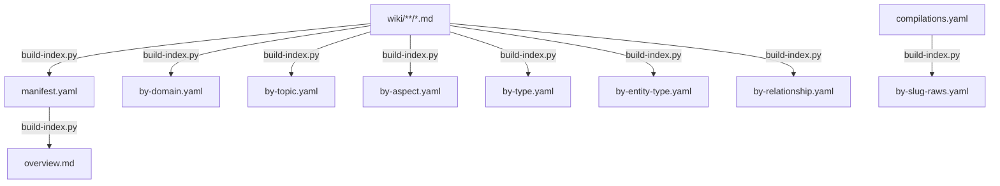

# Append-Only State Model

The platform tracks all operations through append-only YAML ledgers. Derived indexes are regenerable from wiki pages alone. State is auditable, crash-safe, and recoverable.

## Context

The platform needs to track what has been imported, compiled, verified, and expanded — both for operational correctness (don't reprocess unchanged content) and for auditability (trace any page back to its sources). Traditional approaches use databases or mutable state files, but this platform operates in a git-based environment where human-readable, diffable state is valuable.

The design uses append-only YAML files as event logs. Entries are added after each operation completes. Derived artifacts (manifest, reverse indexes) are regenerated from source data, never maintained as separate truth.

## Specs

- [Content Safety](../specs/content-safety.md) — append-only ledgers provide audit trail
- [Continuous Quality](../specs/continuous-quality.md) — state tracking for verification and decay

## Architecture

### State Ledgers

Five append-only files track operations:

| Ledger | Written By | Read By | Tracks |
|--------|-----------|---------|--------|
| `instance/state/imports.yaml` | Import | Compile (queue), Import (dedup) | URL → raw path, title, content_type, hash |
| `instance/state/compilations.yaml` | Compile | Expand, Verify (via by-slug-raws) | Raw file → wiki pages, facet assignments |
| `instance/state/expansions.yaml` | Expand | Expand (avoid re-proposing) | Topics proposed, accepted, rejected |
| `instance/state/enhancements.yaml` | Enhance | Expand (gap consumption) | Gap findings, approval status |
| `instance/state/verifications.yaml` | Verify | Verify (cooldown gate) | Claims checked, verdicts, fixes, confidence transitions |

Each ledger has a single writer and one or more readers. No ledger is written by multiple commands — this eliminates write conflicts.

### Append-Only Invariant

Entries are appended AFTER the side effect completes, never before. This provides crash safety:

- If the operation crashes before writing the entry → no ledger record → work will be retried on the next run
- If the operation succeeds and appends the entry → the record is permanent and won't be reprocessed

Entries are never modified or deleted during normal operation. The ledger is a complete history of every operation performed.

### Queue Derivation

The compile queue is derived mechanically from the difference between raw files and the compilations ledger:

```
for each file in raw/**/*:
    hash = sha256(content)[:8]
    if no entry in compilations.yaml where raw == file AND raw_hash == hash:
        → needs compiling
```

This is a content-addressed check. If a raw file changes (re-imported with new content), its hash changes and it re-enters the compile queue. If it hasn't changed, it's skipped.

Import dedup works similarly: check `imports.yaml` for a matching source URL before fetching.

### Derived State

All indexes are regenerable. `sprue/scripts/build-index.py` reconstructs everything from wiki pages alone:



The manifest (`wiki/.index/manifest.yaml`) is the machine-readable index of all pages — slug, title, type, facets, confidence, summary, links, directory. It is the single source of truth for page metadata, generated from frontmatter.

`by-slug-raws.yaml` is special: it's derived from `compilations.yaml` filtered against the current manifest. Orphaned entries (pages that no longer exist) are dropped during generation. This index is consumed by Verify (to find raw sources for fact-checking) and by recompilation (to trace wiki pages back to raw files).

Design Principle 6 applies: "Everything regenerable is regenerated. If it can be derived, don't store it separately."

### Recovery

All state files are safe to delete:

| Deleted File | Impact | Recovery |
|-------------|--------|----------|
| `imports.yaml` | Lose dedup history and titles | Compile still works (reads raw files directly). Re-importing URLs may duplicate. |
| `compilations.yaml` | Next compile treats all raw files as uncompiled | Pipeline idempotency prevents duplicate wiki pages. |
| `expansions.yaml` | Next expand re-analyzes everything | No data loss — just rework. |
| `enhancements.yaml` | Enhance-flagged gaps are lost | Next enhance regenerates them. |
| `verifications.yaml` | Verification history lost | Next verify re-checks from scratch. |

Deleting derived indexes (manifest, by-*.yaml) has no impact — `build-index.py` regenerates them fully from wiki pages.

### Operational Logging

In addition to state ledgers, `memory/log.jsonl` provides a human-readable operation log. Each entry is a JSON object with timestamp, operation name, title, counts (created, modified, deleted), and a summary. This is an audit trail, not operational state — the system functions correctly without it.

## Interfaces

| Component | Role |
|-----------|------|
| `instance/state/*.yaml` | The five append-only ledgers |
| `instance/state/README.md` | Documents ledger schemas, queue derivation, recovery |
| `sprue/scripts/build-index.py` | Regenerates all derived indexes from wiki + compilations |
| `sprue/scripts/config.py` | Loads and merges config (consumed by build-index.py and others) |
| `wiki/.index/manifest.yaml` | Machine-readable page metadata (derived) |
| `wiki/.index/by-*.yaml` | Reverse indexes by facet, type, entity-type, relationship (derived) |
| `wiki/.index/by-slug-raws.yaml` | Slug → raw file paths (derived from compilations.yaml) |
| `memory/log.jsonl` | Append-only operation audit trail |

## Decisions

- [ADR-0014: Emergent Data Structures — Synonyms, Signals, Guards](../decisions/0014-emergent-data-structures.md) — auxiliary structures derived from content, not manually curated
- [ADR-0017: Operational Logging — JSONL and Summary Fields](../decisions/0017-operational-logging.md) — why JSONL for the audit trail
- [ADR-0010: Slug-Based Addressing](../decisions/0010-slug-based-addressing.md) — stable identifiers that survive directory reorganization, enabling by-slug-raws.yaml
