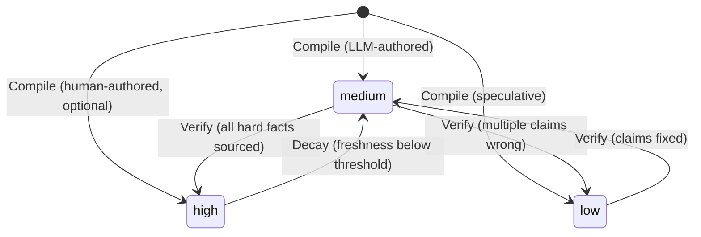

# Confidence State Machine

Content quality is tracked through a confidence state (high/medium/low) that is earned through verification, degraded through time-based decay, and never self-assigned by the LLM. Confidence is an operational state, not a judgment.

## Context

LLMs produce confident-sounding text regardless of factual accuracy. An early calibration found ~70% of LLM-self-assigned "high confidence" pages had factual errors on verifiable claims. The platform needed a quality model where confidence reflects actual verification status, not the LLM's internal certainty.

Additionally, content ages at different rates. A page about the latest API version becomes stale in months; a page about distributed consensus algorithms stays relevant for years. The quality model must account for domain-specific decay and prioritize re-verification where it matters most.

## Specs

- [Continuous Quality](../specs/continuous-quality.md) — confidence is earned, content degrades, quality is visible

## Architecture

### State Transitions

Three states, governed by strict transition rules:

| Transition | Trigger | Condition |
|-----------|---------|-----------|
| → `medium` | Compile | Default for `author: llm` pages |
| → `low` | Compile | Explicit: speculative or uncertain content |
| → `high` | Compile | Only for `author: human` pages (exempt from invariant) |
| `medium` → `high` | Verify | All hard factual claims confirmed or fixed from Tiers 1-3; no security misstatements; remaining unverifiable claims are hedged guidance only |
| `medium` → `low` | Verify | Multiple claims found `wrong` without clear fixes |
| `high` → `medium` | Decay | Effective freshness drops below promotion threshold |
| `low` → `medium` | Verify | Previously wrong claims fixed with source evidence |

### The Confidence Invariant

For `author: llm` pages, Compile writes `confidence: medium` (default) or `confidence: low` (speculative). It never writes `confidence: high`. Only `sprue/protocols/verify.md`, after source-backed fact-checking, promotes to `high` and sets `last_verified` to a real date.

This invariant is enforced at three levels:
1. **Protocol prose** — `compile.md` explicitly states "never high"
2. **Executable rule** — `memory/rules.yaml` includes a check: `if author:llm AND confidence:high AND last_verified:null → FAIL`
3. **Design principle** — Confidence for LLM-authored content is an operational state, not a judgment the LLM makes about its own output

Human-authored (`author: human` or `hybrid`) pages are exempt. A human may set any confidence at write time.

### Decay Model

Content freshness degrades over time via a sigmoid curve (no cliff effects — gradual degradation, not sudden obsolescence).

**Effective half-life** = `half_life_tiers[decay_tier]` × `risk_tier_multipliers[risk_tier]`

| Decay Tier | Half-Life | Typical Content |
|-----------|-----------|-----------------|
| `fast` | 90 days | APIs, frameworks, cloud services |
| `medium` | 150 days | Languages, databases, tools |
| `stable` | 365 days | Protocols, algorithms, standards |
| `glacial` | 600 days | Math, fundamentals, core CS theory |

| Risk Tier | Multiplier | Effect |
|-----------|-----------|--------|
| `critical` | 0.5× | Halves the half-life (wrong info is dangerous) |
| `operational` | 1.0× | Neutral |
| `conceptual` | 1.5× | Extends half-life (concepts age slower) |
| `reference` | 1.0× | Neutral |

Example: A `fast` decay page about an API with `critical` risk tier has an effective half-life of 90 × 0.5 = 45 days. It will be flagged for re-verification quickly.

### Decay Modifiers

Three additional factors affect decay:

**Per-page jitter.** Each page's decay is offset by a deterministic jitter derived from its slug hash. This spreads verification load: pages don't all become stale at the same time.

**Author multiplier.** LLM-authored content decays 1.5× faster than human-authored content. Human writing is assumed to be more carefully fact-checked at creation time.

**Never-verified penalty.** Pages that have never been verified (last_verified: null) start at 80% freshness — they never had full credibility. This creates urgency to verify new content.

### Promotion Criteria

A page qualifies for `confidence: high` only when:

1. All hard factual claims are either `confirmed` (source-backed) or `fixed` (source-backed replacement applied)
2. Remaining `unverifiable` claims are only hedged experience-based guidance, not hard facts
3. No `security_misstatement` errors were found (or all were fixed)

If any hard fact remains unverifiable after exhausting all source tiers, the page stays at `medium`. Security misstatements always block promotion — wrong security information causes real harm.

### Verification Prioritization

`sprue/scripts/prioritize.py` scores pages for verification targeting using weighted factors:

| Factor | Weight | Rationale |
|--------|--------|-----------|
| Freshness | 0.35 | Never-verified pages are top priority |
| Risk | 0.30 | Critical pages matter most |
| Decay | 0.15 | Stale pages need checking |
| Impact | 0.15 | Pages with many inbound links matter |
| Source | 0.05 | Pages with authoritative sources are lower priority (already grounded) |

The scoring produces a ranked list. In semi-auto mode, the top N are verified without approval. In manual mode, the list is presented for human selection.

## Interfaces

| Component | Role |
|-----------|------|
| `sprue/protocols/compile.md` | Writes initial confidence (medium/low), decay_tier, risk_tier, author |
| `sprue/protocols/verify.md` | Promotes confidence to high, sets last_verified date |
| `sprue/scripts/decay.py` | Calculates freshness, applies decay, downgrades confidence |
| `sprue/scripts/prioritize.py` | Scores pages for verification targeting |
| `sprue/defaults.yaml` → `half_life_tiers` | Half-life values per decay tier |
| `sprue/defaults.yaml` → `risk_tier_multipliers` | Risk-based multipliers |
| `sprue/defaults.yaml` → `verify.weights` | Prioritization scoring weights |
| `sprue/defaults.yaml` → `verify.cooldown_days` | Minimum days between re-verifications |
| `memory/rules.yaml` | Enforces the confidence invariant as an executable check |

## Decisions

- [ADR-0015: Content Quality Model — Confidence, Decay, and Self-Healing](../decisions/0015-content-quality-model.md) — why confidence levels with decay tiers over binary reviewed/unreviewed
- [ADR-0009: Verification Pipeline — Shift-Left to Adversarial](../decisions/0009-verification-pipeline.md) — how verification earns the confidence: high state
