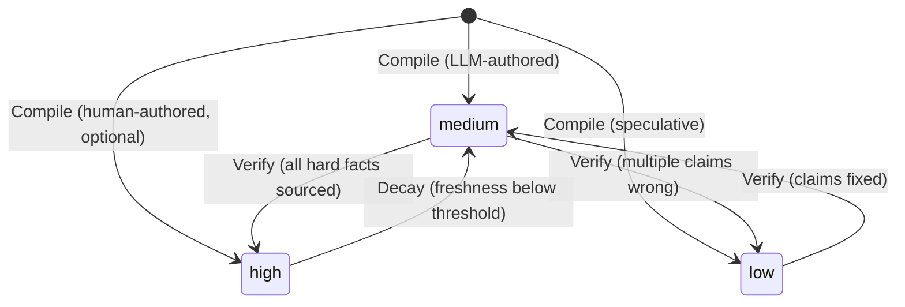

# Confidence State Machine

Content quality is tracked through a confidence state (high/medium/low) that is earned through verification, degraded through time-based decay, and never self-assigned by the LLM. Confidence is an operational state, not a judgment.

## Context

LLMs produce confident-sounding text regardless of factual accuracy. An early calibration found ~70% of LLM-self-assigned "high confidence" pages had factual errors on verifiable claims. The platform needed a quality model where confidence reflects actual verification status, not the LLM's internal certainty.

Additionally, content ages at different rates. A page about the latest API version becomes stale in months; a page about distributed consensus algorithms stays relevant for years. The quality model must account for domain-specific decay and prioritize re-verification where it matters most.

## Specs

- [Continuous Quality](../specs/continuous-quality.md) — confidence is earned, content degrades, quality is visible
- [Continuous Quality — Source Health Invariant](../specs/continuous-quality.md) — source health monitoring as an operational quality invariant

## Architecture

### State Transitions



Three states, governed by strict transition rules:

| Transition | Trigger | Condition |
|-----------|---------|-----------|
| → `medium` | Compile | Default for `author: llm` pages |
| → `low` | Compile | Explicit: speculative or uncertain content |
| → `high` | Compile | Only for `author: human` pages (exempt from invariant) |
| `medium` → `high` | Verify | All hard factual claims confirmed or fixed from Tiers 1-3; no security misstatements; remaining unverifiable claims are hedged guidance only |
| `medium` → `low` | Verify | Multiple claims found `wrong` without clear fixes |
| `high` → `medium` | Decay | Effective freshness drops below promotion threshold |
| `low` → `medium` | Verify | Previously wrong claims fixed with source evidence |

### The Confidence Invariant

For `author: llm` pages, Compile writes `confidence: medium` (default) or `confidence: low` (speculative). It never writes `confidence: high`. Only `sprue/protocols/verify.md`, after source-backed fact-checking, promotes to `high` and sets `last_verified` to a real date.

This invariant is enforced at three levels:
1. **Protocol prose** — `compile.md` explicitly states "never high"
2. **Executable rule** — `memory/rules.yaml` includes a check: `if author:llm AND confidence:high AND last_verified:null → FAIL`
3. **Design principle** — Confidence for LLM-authored content is an operational state, not a judgment the LLM makes about its own output

Human-authored (`author: human` or `hybrid`) pages are exempt. A human may set any confidence at write time.

### Decay Model

Content freshness degrades over time via a sigmoid curve (no cliff effects — gradual degradation, not sudden obsolescence).

**Effective half-life** = `half_life_tiers[decay_tier]` × `risk_tier_multipliers[risk_tier]`

| Decay Tier | Half-Life | Typical Content |
|-----------|-----------|-----------------|
| `fast` | 90 days | APIs, frameworks, cloud services |
| `medium` | 150 days | Languages, databases, tools |
| `stable` | 365 days | Protocols, algorithms, standards |
| `glacial` | 600 days | Math, fundamentals, core CS theory |

| Risk Tier | Multiplier | Effect |
|-----------|-----------|--------|
| `critical` | 0.5× | Halves the half-life (wrong info is dangerous) |
| `operational` | 1.0× | Neutral |
| `conceptual` | 1.5× | Extends half-life (concepts age slower) |
| `reference` | 1.0× | Neutral |

Example: A `fast` decay page about an API with `critical` risk tier has an effective half-life of 90 × 0.5 = 45 days. It will be flagged for re-verification quickly.

### Decay Modifiers

Three additional factors affect decay:

**Per-page jitter.** Each page's decay is offset by a deterministic jitter derived from its slug hash. This spreads verification load: pages don't all become stale at the same time.

**Author multiplier.** LLM-authored content decays 1.5× faster than human-authored content. Human writing is assumed to be more carefully fact-checked at creation time.

**Never-verified penalty.** Pages that have never been verified (last_verified: null) start at 80% freshness — they never had full credibility. This creates urgency to verify new content.

### Promotion Criteria

A page qualifies for `confidence: high` only when:

1. All hard factual claims are either `confirmed` (source-backed) or `fixed` (source-backed replacement applied)
2. Remaining `unverifiable` claims are only hedged experience-based guidance, not hard facts
3. No `security_misstatement` errors were found (or all were fixed)

If any hard fact remains unverifiable after exhausting all source tiers, the page stays at `medium`. Security misstatements always block promotion — wrong security information causes real harm.

### Source Health Monitoring

Source URLs degrade independently of content age. A page verified against an authoritative URL may lose its evidentiary basis if that URL dies, redirects, or changes content. Source health monitoring detects these events and feeds them into the verification prioritization pipeline.

#### Health Check Targets

Two categories of URLs form the monitoring set:

1. **Registry URLs** — entries in `instance/sources.yaml` (the curated authoritative docs registry). These are the Tier 2 sources used across multiple pages.
2. **Claim URLs** — `source_url` values in verification ledger entries. These are the specific URLs that confirmed individual claims.

Registry URLs are checked on a fixed interval (`config.source_authority.health_check.interval_days`). Claim URLs are checked when their parent page enters the verification prioritization queue (lazy evaluation — no separate crawl schedule).

#### Drift Categories

| Category | Detection Method | Severity | Response |
|----------|-----------------|----------|----------|
| **Source gone** | HTTP 4xx/5xx, DNS failure, or timeout | High | Flag page for re-verification. Record `url_status: dead` in health ledger. |
| **Source redirected** | HTTP 3xx chain exceeds `max_redirects` or lands on different content | Low | Log final URL. Re-verify only if final destination content differs. |
| **Excerpt missing** | Source is live but cited excerpt (substring match) no longer appears | Medium | Flag affected claims for re-verification. |
| **Page-level drift** | Full-page content hash changed since last check | Advisory | No action unless excerpt-level drift also detected. |

The detection hierarchy is intentional: page-level drift is common (sites update constantly) but usually irrelevant. Excerpt-level drift is rare but actionable — it means the specific evidence for a claim may have changed.

#### Health State Ledger

Results are written to `instance/state/source-health.yaml`, following the [Append-Only State Model](append-only-state.md):

```yaml
# instance/state/source-health.yaml
- checked_at: '2026-05-01T10:00:00Z'
  url: https://kafka.apache.org/documentation/#brokerconfigs_log.retention.hours
  url_status: live           # live | dead | redirected
  http_status: 200
  redirect_chain: []
  page_hash: "sha256:def456..."
  excerpts_checked:
    - claim_id: src-1
      page: kafka
      excerpt_present: true
    - claim_id: src-3
      page: kafka-security
      excerpt_present: false  # drift detected
```

Each check appends a new entry; the latest entry per URL is authoritative for current health status. Excerpt drift is detected by comparing the `excerpt_hash` stored in the [Per-Claim Verification Ledger](source-authority-model.md#per-claim-verification-ledger) against re-fetched content.

#### Integration with Decay and Prioritization

Source health events do **not** directly downgrade confidence — a dead URL does not mean the claim is wrong. Instead, health events feed into the verification prioritization score as a boost factor:

- **Source gone** → adds a priority boost equivalent to `config.verify.weights.freshness` (highest weight). The page is treated as if it were never-verified for prioritization purposes.
- **Excerpt missing** → adds a moderate priority boost. Only the affected claims need re-verification, not the entire page.
- **Page-level drift without excerpt drift** → no priority change.

This design avoids false confidence downgrades (a temporary DNS failure should not demote a well-verified page) while ensuring that genuinely degraded sources are re-verified promptly. Whether dead sources should trigger automatic confidence downgrade is deferred to a future ADR-lite.

When the verify protocol encounters a dead Tier 1/2 source, it checks the health ledger before attempting a fetch — avoiding redundant network requests and enabling graceful fallback to lower tiers.

#### Opt-In Design

Health checking is disabled by default (`config.source_authority.health_check.enabled: false`). It requires network access, which not all environments provide. When disabled, the system operates exactly as it does today — time-based decay is the only degradation signal.

When enabled, the health check runs as a sub-task of the maintain protocol, not as a standalone command. `sprue/scripts/check-source-health.py` performs HTTP liveness checks and excerpt-level substring matching (v1) against stored `excerpt_hash` values from the verification ledger.

### Verification Prioritization

`sprue/scripts/prioritize.py` scores pages for verification targeting using weighted factors:

| Factor | Weight | Rationale |
|--------|--------|-----------|
| Freshness | 0.35 | Never-verified pages are top priority |
| Risk | 0.30 | Critical pages matter most |
| Decay | 0.15 | Stale pages need checking |
| Impact | 0.15 | Pages with many inbound links matter |
| Source | 0.05 | Pages with authoritative sources are lower priority (already grounded) |

The scoring produces a ranked list. In semi-auto mode, the top N are verified without approval. In manual mode, the list is presented for human selection.

When source health monitoring is enabled, pages with dead or drifted source URLs receive a priority boost — see [Source Health Monitoring](#source-health-monitoring) above.

## Interfaces

| Component | Role |
|-----------|------|
| `sprue/protocols/compile.md` | Writes initial confidence (medium/low), decay_tier, risk_tier, author |
| `sprue/protocols/verify.md` | Promotes confidence to high, sets last_verified date |
| `sprue/scripts/decay.py` | Calculates freshness, applies decay, downgrades confidence |
| `sprue/scripts/prioritize.py` | Scores pages for verification targeting |
| `sprue/defaults.yaml` → `half_life_tiers` | Half-life values per decay tier |
| `sprue/defaults.yaml` → `risk_tier_multipliers` | Risk-based multipliers |
| `sprue/defaults.yaml` → `verify.weights` | Prioritization scoring weights |
| `sprue/defaults.yaml` → `verify.cooldown_days` | Minimum days between re-verifications |
| `memory/rules.yaml` | Enforces the confidence invariant as an executable check |
| `sprue/scripts/check-source-health.py` | Checks URL liveness and excerpt drift for source URLs |
| `instance/state/source-health.yaml` | Append-only ledger of source health check results |
| `sprue/defaults.yaml` → `source_authority.health_check.*` | Health check enable flag, interval, timeout, max redirects |

## Decisions

- [ADR-0015: Content Quality Model — Confidence, Decay, and Self-Healing](../decisions/0015-content-quality-model.md) — why confidence levels with decay tiers over binary reviewed/unreviewed
- [ADR-0009: Verification Pipeline — Shift-Left to Adversarial](../decisions/0009-verification-pipeline.md) — how verification earns the confidence: high state
- [ADR-0042: Dead sources boost verification priority, not downgrade confidence](../decisions/0042-source-health-priority-boost.md) — why source health events boost priority rather than directly downgrading confidence
