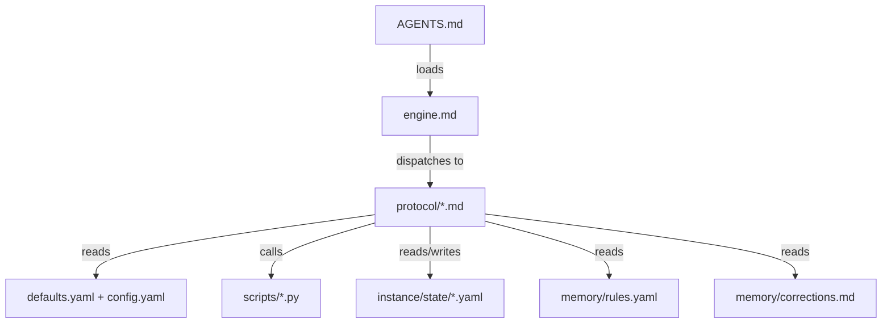

# Prose-as-Code Execution Model

The platform uses markdown protocols as executable code, interpreted by an LLM runtime. Protocols are not documentation — they are instructions the LLM follows to perform operations.

## Context

Traditional knowledge base platforms use conventional programming languages (Python, JavaScript) for their logic, with documentation as a separate artifact that explains the code. This platform inverts that relationship: the logic IS prose, and the LLM IS the interpreter.

This choice was driven by three properties of the problem domain:

1. **Operations require judgment.** Classifying a raw article into facets, deciding whether a page should be a "concept" or an "entity," assessing whether a factual claim is stale — these are not algorithmically solvable. They require domain understanding that only an LLM provides.

2. **Instructions must be human-reviewable.** Platform developers need to read, review, and modify the logic. Prose protocols are readable without specialized training, unlike traditional code that requires language-specific knowledge.

3. **The same artifact serves both purposes.** A prose protocol tells the LLM what to do (executable) AND tells the developer what the system does (readable). There is no gap between spec and implementation — the protocol IS both.

## Architecture

### The Runtime Model

The LLM loads a protocol by reading it into its context window. Protocol elements map to programming constructs:

| Protocol Element | Code Analog |
|-----------------|-------------|
| Step numbers (Step 1, Step 2...) | Program counter |
| Decision trees, classification tiers | Control flow (if/else, switch) |
| `config.dotpath` references | Variable lookups |
| "Read `sprue/engine.md`" | Import / module load |
| "Present to user, wait for approval" | Blocking I/O |
| "Run `bash sprue/verify.sh`" | Foreign function call |
| "Append to `instance/state/compilations.yaml`" | Database write |
| Approval gates (✅ Auto / ❓ Ask / ⚠️ Conflict) | Permission checks |

### Boot Sequence

Every operation begins with a defined import chain:



`AGENTS.md` is the entry point. It loads `engine.md` (the kernel), which defines the operation dispatch table — a jump table mapping user signals to protocol files. The protocol then reads configuration, invokes scripts, and manages state.

This boot sequence is deterministic: every LLM session starts from the same entry point and follows the same import chain. The LLM's prior context or training does not affect which instructions it receives — only what `AGENTS.md` points to matters.

### Division of Labor

The platform has two kinds of executable artifacts. Each handles the work it is best suited for:

| Work Type | Handled By | Rationale |
|-----------|-----------|-----------|
| Classification, synthesis, assessment | Protocol (LLM) | Requires understanding of content and domain context |
| Facet assignment, page generation | Protocol (LLM) | Requires judgment and emergent vocabulary awareness |
| Source fetching, claim extraction | Protocol (LLM) | Requires reading comprehension and authority assessment |
| Index building, hashing, scoring | Script (Python) | Requires deterministic, reproducible output |
| Frontmatter validation, tag checking | Script (Python) | Requires exhaustive schema checking |
| Config merging, decay calculation | Script (Python) | Requires arithmetic precision |

The principle: **scripts handle what can be computed; protocols handle what requires understanding.**

Scripts are invoked by protocols as foreign function calls. For example, `compile.md` calls `bash sprue/verify.sh --file <path>` to validate a page before considering it complete. The script returns pass/fail; the protocol decides what to do with the result.

### Config as External State

Protocols never hardcode thresholds. All tunable values live in `sprue/defaults.yaml` (platform defaults) and `instance/config.yaml` (instance overrides). Protocols reference them via `config.dotpath` notation:

```
config.facets.domain.creation_threshold → 10
config.size_profiles.standard.max_words → 3000
config.verify.cooldown_days → 30
```

This separation allows instance operators to tune behavior without modifying protocol prose. A cooking KB can raise `creation_threshold` to 15 without touching `compile.md`.

Scripts load config through `sprue/scripts/config.py`, which deep-merges defaults with instance overrides. The LLM reads both YAML files and applies the same merge mentally.

### Inline Validation

Protocols do not rely on post-hoc testing. Validation runs inline during execution:

```
compile.md Step 10:
  "Run bash sprue/verify.sh --file <path>.
   Fix violations before proceeding."
```

If any validator fails, the protocol stops. A page that fails `check-frontmatter.py` is not written to the wiki. This is the equivalent of a compile-time error in traditional code — the artifact is rejected before it reaches production.

The validators in `sprue/scripts/` are the test suite:

- `check-frontmatter.py` — asserts all required YAML fields are present and valid
- `check-tags.py` — asserts facet values respect cardinality limits
- `check-entity-types.py` — asserts entity pages use registered types
- `check-config.py` — asserts configuration is internally consistent
- `verify.py` — runs all rules from `memory/rules.yaml`

### Prompt Templates as Subroutines

`sprue/prompts/*.md` files are subroutines called by protocols. When `compile.md` reaches the page-generation step, it reads `sprue/prompts/wiki_page.md` (or whichever strategy is configured) as a sub-procedure. The prompt template defines the structure, depth, and formatting rules for the generated page.

Verification prompts follow the same pattern: `verify-writer.md`, `verify-critic.md`, and `verify-judge.md` define three independent roles that `verify.md` can invoke as separate LLM passes.

## Interfaces

| Component | Role | Consumed By |
|-----------|------|------------|
| `AGENTS.md` | Entry point / boot | LLM on session start |
| `sprue/engine.md` | Kernel — architecture, dispatch, schema | Every protocol (first read) |
| `sprue/protocols/*.md` | Executable procedures | LLM during operations |
| `sprue/scripts/*.py` | Deterministic subroutines + validators | Protocols via `bash` / `python3` calls |
| `sprue/prompts/*.md` | Subroutine templates | Protocols during generation/verification |
| `sprue/defaults.yaml` | Platform config defaults | Scripts via `config.py`, LLM via direct read |
| `instance/config.yaml` | Instance overrides | Merged with defaults at load time |
| `memory/rules.yaml` | Runtime assertions | `verify.py` executes as inline checks |

## Specs

- [Platform Reusability](../specs/platform-reusability.md) — domain-agnostic execution enables reuse
- [Content Safety](../specs/content-safety.md) — deterministic protocol execution prevents content corruption

## Decisions

- [ADR-0022: Agent Bootstrap — AGENTS.md Import Chain](../decisions/0022-agent-bootstrap.md) — why a single entry point with a defined import chain
- [ADR-0006: Configuration Layering — Platform Defaults + Instance Overrides](../decisions/0006-configuration-layering.md) — why config is externalized and deep-merged
- [ADR-0013: Tooling and CI Pipeline](../decisions/0013-tooling-and-ci-pipeline.md) — why Python scripts (not bash) for validation
