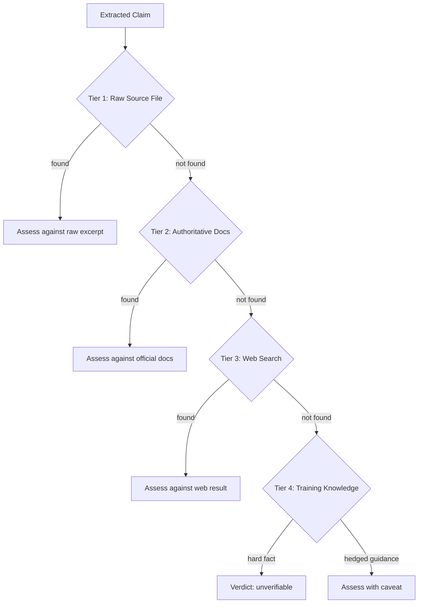
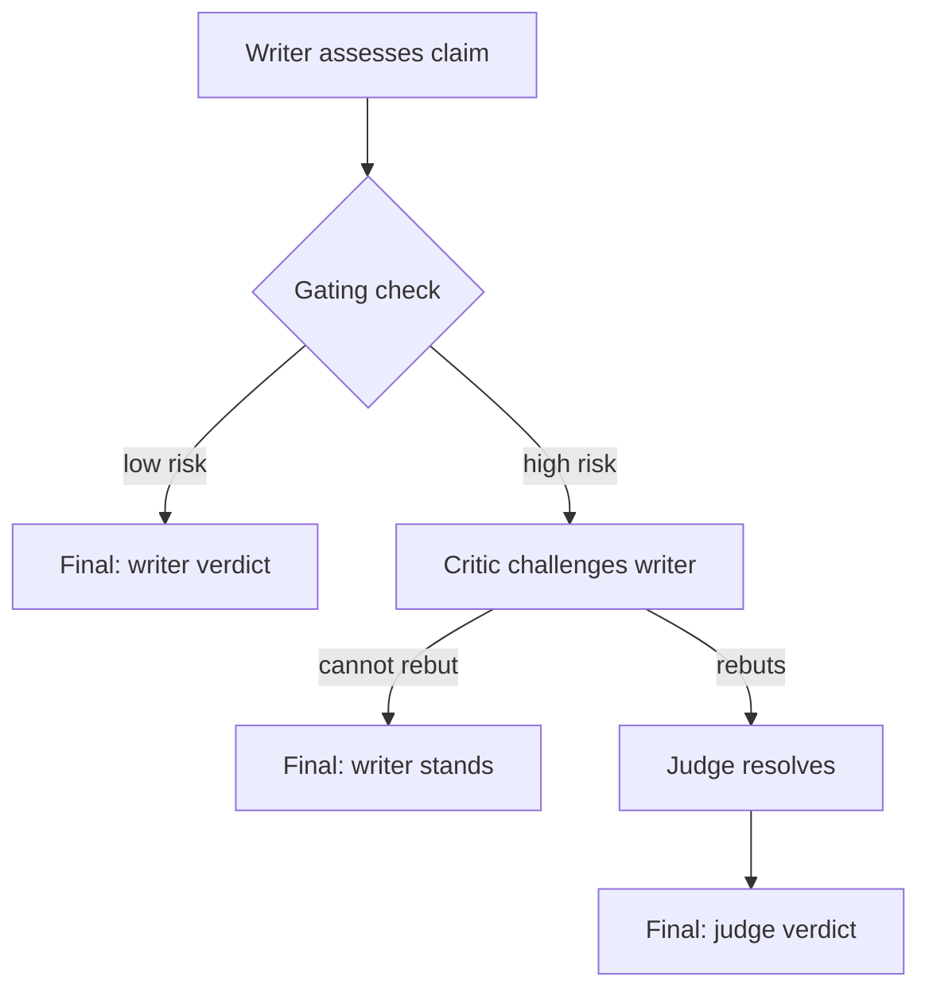

# Source Authority Model

The platform grounds knowledge in human-produced sources, not LLM training data. Verification uses a tiered source escalation ladder where authority decreases with each tier. Training knowledge is the last resort and cannot alone confirm hard factual claims.

## Context

LLMs generate fluent, confident text regardless of factual accuracy. Early calibration found ~70% of LLM-self-assigned "high confidence" pages had factual errors on verifiable claims. The platform needed a verification architecture that forces every factual claim to be checked against external, human-produced sources — not against the LLM's own parametric knowledge.

The design treats the LLM as synthesizer and assessor, not as source. The LLM reads sources, extracts claims, compares claims to source material, and proposes fixes. But the sources themselves must be human-produced and externally verifiable.

## Specs

- [Source-Grounded Knowledge](../specs/source-grounded-knowledge.md) — every fact traces to a human-produced source
- [Source Authority Pipeline](../specs/source-authority-pipeline.md) — per-claim provenance chain (draft)

## Architecture

### Tiered Source Escalation

When verifying a claim, the system exhausts sources in order of authority. No tier is skipped.



| Tier | Source | Authority | Can Confirm Hard Facts? |
|------|--------|-----------|------------------------|
| 1 | Raw source file (the article that produced this page) | Highest — direct provenance | Yes |
| 2 | `instance/sources.yaml` (curated authoritative docs registry) | High — official documentation | Yes |
| 3 | Web search targeting authoritative domains | Medium — may be current but unvetted | Yes |
| 4 | LLM training knowledge | Lowest — parametric, may be stale or wrong | **No** (for hard facts) |

The critical constraint: **training knowledge alone cannot confirm a hard factual claim.** Version numbers, default values, configuration settings, performance metrics, security properties — these must be sourced from Tiers 1-3. If all three tiers are exhausted without finding a source, the claim is marked `unverifiable`, not `confirmed`.

### Authority Domain Hierarchy

When searching the web (Tier 3), the system prefers authoritative domains:

1. Official project sites (`.org`, `.io`, `.dev`) — highest
2. Official vendor documentation (`docs.aws.amazon.com`, `kubernetes.io`)
3. GitHub repositories (README, docs/)
4. Wikipedia — good for dates, events, standards
5. Reputable security blogs — good for CVEs, incidents

Avoided: random blog posts, StackOverflow answers, marketing pages, content farms.

### Claim Extraction

Not all page content is verifiable. The system distinguishes:

**Verifiable claims** (extract and check):
- Version numbers ("Kafka 3.6", "TLS 1.3")
- Default values ("retention defaults to 7 days")
- Configuration settings ("set MaxAuthTries 3")
- Performance numbers ("p99 < 100ms")
- Behavioral assertions ("auto-commit commits before processing")
- Security properties ("RSA key exchange has no forward secrecy")
- Limits and capacity ("max message size 1MB")
- Named events with dates

**Non-verifiable claims** (skip):
- Pure opinions ("Kafka is excellent for streaming")
- Tautological definitions ("a load balancer distributes load")
- General principles ("security is important")
- Subjective emphasis ("certificate expiry is THE #1 cause")
- Hedged experience-based estimates ("typically 2-5 minutes")

### Verdict Taxonomy

Each claim receives exactly one verdict:

| Verdict | Meaning | Action |
|---------|---------|--------|
| `confirmed` | Authoritative source explicitly supports the claim | No change needed |
| `stale` | Claim references a version or value that has changed | Fix with current value + source citation |
| `wrong` | Authoritative source directly contradicts the claim | Fix with correct value + source citation |
| `unverifiable` | All four source tiers exhausted, no source found | Flag; may block confidence promotion |

The `wrong` verdict requires a specific source excerpt that contradicts the claim. When in doubt after exhausting sources, the verdict is `unverifiable` — the system never guesses.

### Adversarial Mode

For high-risk claims, the verification uses a multi-role model:



**Writer** — Single-pass assessment. Reads the claim, reads the source, emits a verdict with rationale.

**Critic** — Challenges the writer's verdict. Looks for five failure modes: missed context, version confusion, scope mismatch, hedging misread, and source staleness.

**Judge** — Resolves disagreements between writer and critic. Reads both assessments, makes the final call.

Gating rules control when the critic is invoked:
- Always: explicit `--adversarial` flag or `risk_tier: critical` pages
- Conditionally: `risk_tier: operational` with hard-fact claims (versions, defaults, limits, security)
- Always: when writer verdict is `unverifiable` (cheapest high-value trigger)
- Never: conceptual/reference pages with only hedged claims

### Authoritative Sources Registry

`instance/sources.yaml` is a curated mapping of topics to authoritative documentation URLs. It is hand-maintained by the instance operator and checked during Tier 2:

```yaml
postgresql:
  - name: PostgreSQL Docs (current)
    url: https://www.postgresql.org/docs/current/
kafka:
  - name: Apache Kafka Documentation
    url: https://kafka.apache.org/documentation/
tls:
  - name: RFC 8446 (TLS 1.3)
    url: https://datatracker.ietf.org/doc/html/rfc8446
```

This registry embeds domain expertise: the instance operator knows which sources are canonical for each technology. The LLM consults this registry before falling back to web search.

## Interfaces

| Component | Role |
|-----------|------|
| `sprue/protocols/verify.md` | Implements the full verification pipeline |
| `sprue/prompts/verify-writer.md` | Single-pass assessment template |
| `sprue/prompts/verify-critic.md` | Adversarial rebuttal template |
| `sprue/prompts/verify-judge.md` | Tie-breaker template |
| `instance/sources.yaml` | Authoritative documentation registry (Tier 2) |
| `instance/state/verifications.yaml` | Records verdicts, source tiers used, fixes applied |
| `sprue/scripts/prioritize.py` | Scores pages for verification targeting |
| `wiki/.index/by-slug-raws.yaml` | Maps slugs to raw files for Tier 1 lookup |
| `config.verify.weights` | Prioritization scoring weights |
| `config.verify.cooldown_days` | Minimum days between re-verifications |

## Decisions

- [ADR-0009: Verification Pipeline — Shift-Left to Adversarial](../decisions/0009-verification-pipeline.md) — why three-pass adversarial over single-pass review
- [ADR-0002: Content Safety Invariants](../decisions/0002-content-safety-invariants.md) — the foundational principle that content must trace to human-produced sources
- [ADR-0019: LLM Retrieval Optimization](../decisions/0019-llm-retrieval-optimization.md) — how source retrieval efficiency improves with scale
