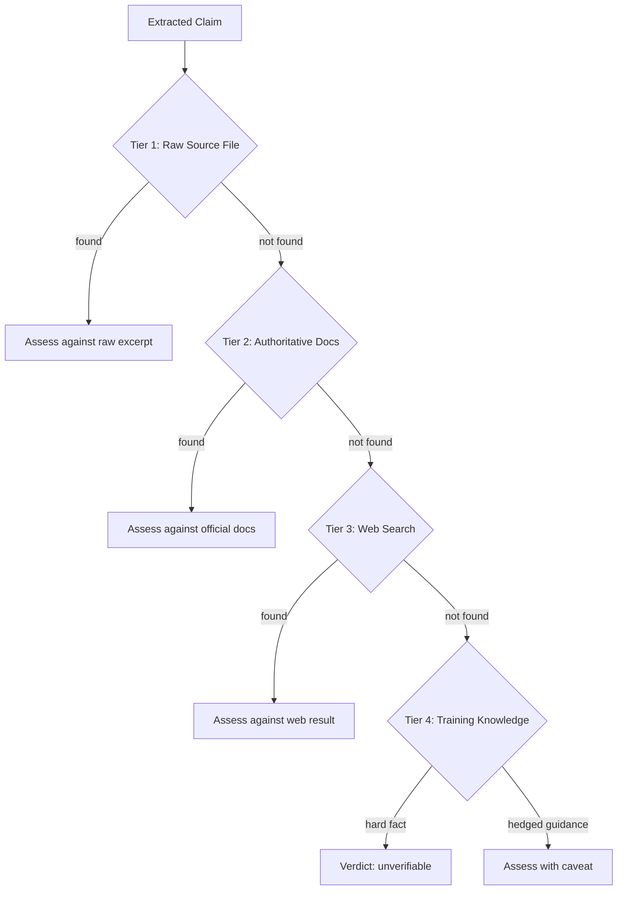
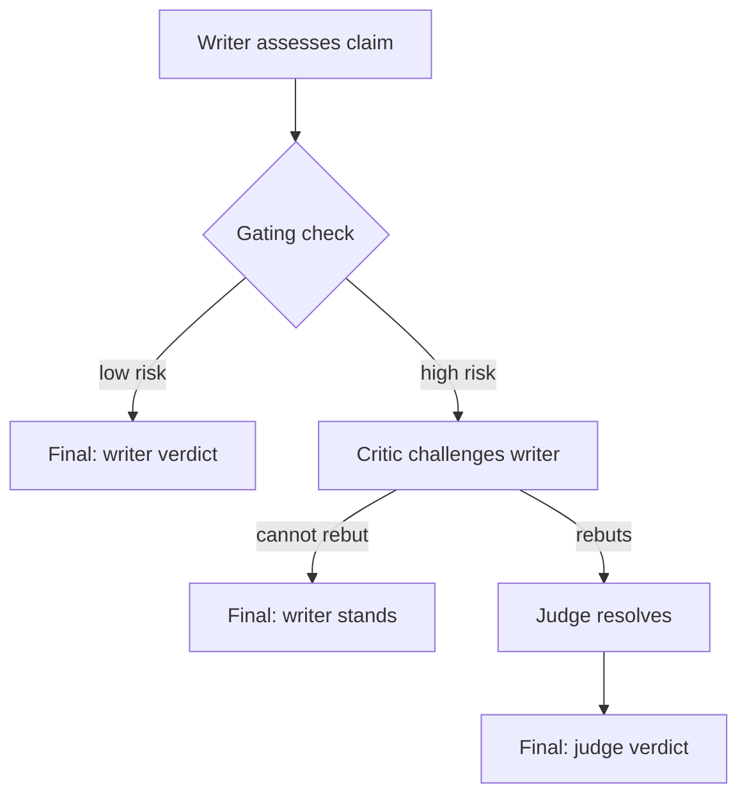

# Source Authority Model

The platform grounds knowledge in human-produced sources, not LLM training data. Verification uses a tiered source escalation ladder where authority decreases with each tier. Training knowledge is the last resort and cannot alone confirm hard factual claims.

## Context

LLMs generate fluent, confident text regardless of factual accuracy. Early calibration found ~70% of LLM-self-assigned "high confidence" pages had factual errors on verifiable claims. The platform needed a verification architecture that forces every factual claim to be checked against external, human-produced sources — not against the LLM's own parametric knowledge.

The design treats the LLM as synthesizer and assessor, not as source. The LLM reads sources, extracts claims, compares claims to source material, and proposes fixes. But the sources themselves must be human-produced and externally verifiable.

## Specs

- [Source-Grounded Knowledge](../specs/source-grounded-knowledge.md) — every fact traces to a human-produced source; provenance completeness invariant (every verified claim has a source chain); source quality ranking invariant (tiers are exhausted in order)
- [Per-Claim Source Provenance](../specs/source-authority-pipeline.md) — per-claim attribution, machine-queryable provenance, cite-then-claim (draft)

## Architecture

### Tiered Source Escalation

When verifying a claim, the system exhausts sources in order of authority. No tier is skipped.



| Tier | Source | Authority | Can Confirm Hard Facts? |
|------|--------|-----------|------------------------|
| 1 | Raw source file (the article that produced this page) | Highest — direct provenance | Yes |
| 2 | `instance/sources.yaml` (curated authoritative docs registry) | High — official documentation | Yes |
| 3 | Web search targeting authoritative domains | Medium — may be current but unvetted | Yes |
| 4 | LLM training knowledge | Lowest — parametric, may be stale or wrong | **No** (for hard facts) |

The critical constraint: **training knowledge alone cannot confirm a hard factual claim.** Version numbers, default values, configuration settings, performance metrics, security properties — these must be sourced from Tiers 1-3. If all three tiers are exhausted without finding a source, the claim is marked `unverifiable`, not `confirmed`.

### Authority Domain Hierarchy

When searching the web (Tier 3), the system prefers authoritative domains:

1. Official project sites (`.org`, `.io`, `.dev`) — highest
2. Official vendor documentation (`docs.aws.amazon.com`, `kubernetes.io`)
3. GitHub repositories (README, docs/)
4. Wikipedia — good for dates, events, standards
5. Reputable security blogs — good for CVEs, incidents

Avoided: random blog posts, StackOverflow answers, marketing pages, content farms.

### Claim Extraction

Not all page content is verifiable. The system distinguishes:

**Verifiable claims** (extract and check):
- Version numbers ("Kafka 3.6", "TLS 1.3")
- Default values ("retention defaults to 7 days")
- Configuration settings ("set MaxAuthTries 3")
- Performance numbers ("p99 < 100ms")
- Behavioral assertions ("auto-commit commits before processing")
- Security properties ("RSA key exchange has no forward secrecy")
- Limits and capacity ("max message size 1MB")
- Named events with dates

**Non-verifiable claims** (skip):
- Pure opinions ("Kafka is excellent for streaming")
- Tautological definitions ("a load balancer distributes load")
- General principles ("security is important")
- Subjective emphasis ("certificate expiry is THE #1 cause")
- Hedged experience-based estimates ("typically 2-5 minutes")

### Verdict Taxonomy

Each claim receives exactly one verdict:

| Verdict | Meaning | Action |
|---------|---------|--------|
| `confirmed` | Authoritative source explicitly supports the claim | No change needed |
| `stale` | Claim references a version or value that has changed | Fix with current value + source citation |
| `wrong` | Authoritative source directly contradicts the claim | Fix with correct value + source citation |
| `unverifiable` | All four source tiers exhausted, no source found | Flag; may block confidence promotion |

The `wrong` verdict requires a specific source excerpt that contradicts the claim. When in doubt after exhausting sources, the verdict is `unverifiable` — the system never guesses.

### Adversarial Mode

For high-risk claims, the verification uses a multi-role model:



**Writer** — Single-pass assessment. Reads the claim, reads the source, emits a verdict with rationale.

**Critic** — Challenges the writer's verdict. Looks for five failure modes: missed context, version confusion, scope mismatch, hedging misread, and source staleness.

**Judge** — Resolves disagreements between writer and critic. Reads both assessments, makes the final call.

Gating rules control when the critic is invoked:
- Always: explicit `--adversarial` flag or `risk_tier: critical` pages
- Conditionally: `risk_tier: operational` with hard-fact claims (versions, defaults, limits, security)
- Always: when writer verdict is `unverifiable` (cheapest high-value trigger)
- Never: conceptual/reference pages with only hedged claims

### Authoritative Sources Registry

`instance/sources.yaml` is a curated mapping of topics to authoritative documentation URLs. It is hand-maintained by the instance operator and checked during Tier 2:

```yaml
postgresql:
  - name: PostgreSQL Docs (current)
    url: https://www.postgresql.org/docs/current/
kafka:
  - name: Apache Kafka Documentation
    url: https://kafka.apache.org/documentation/
tls:
  - name: RFC 8446 (TLS 1.3)
    url: https://datatracker.ietf.org/doc/html/rfc8446
```

This registry embeds domain expertise: the instance operator knows which sources are canonical for each technology. The LLM consults this registry before falling back to web search.

### Per-Claim Verification Ledger

The verification pipeline produces per-claim attribution records, not just page-level verdicts. Each verifiable claim receives a stable identifier, a source excerpt, and a verdict — stored in the verification ledger and cross-referenced by inline markers in the page body.

#### Claim Identifiers

Each claim receives a page-scoped identifier during verification: `src-1`, `src-2`, etc. Identifiers are assigned sequentially per verification run and are stable within that run. A re-verification of the same page produces new identifiers — the ledger preserves history, and the page body is updated to match the latest run.

The `src-` prefix namespaces claim markers to avoid collision with user-authored footnotes.

#### Inline Citation Markers

Verify inserts footnote-style markers into the page body after each sourced claim:

```markdown
Kafka defaults to 7-day retention[^src-1] and supports up to 200K partitions per cluster[^src-2].
```

Markers are inserted by the verify protocol (Phase 3, new sub-step), never by compile. Compile produces the content; verify annotates it with provenance. This separation preserves the principle that compile is synthesis and verify is assessment.

A `## Sources` heading is appended to the page (if absent) containing the footnote definitions:

```markdown
## Sources

[^src-1]: Kafka Documentation — "The default retention period is 7 days (168 hours)" — https://kafka.apache.org/documentation/#brokerconfigs_log.retention.hours
[^src-2]: Kafka Documentation — "supports up to 200,000 partitions per cluster" — https://kafka.apache.org/documentation/#design_replicatedlog
```

#### Ledger Schema Extension

The existing `claims:` array in `instance/state/verifications.yaml` gains per-claim attribution fields. All new fields are optional — old entries without them parse cleanly (backward compatible).

```yaml
# instance/state/verifications.yaml — extended claims entry
- verified_at: '2026-04-20T14:30:00Z'
  mode: semi+adversarial
  page: kafka
  claims:
    - id: src-1
      claim: "defaults to 7-day retention"
      source_tier_used: raw
      source_ref: raw/articles/kafka-complete-guide.md
      source_excerpt: "The default retention period is 7 days (168 hours)"
      source_url: https://kafka.apache.org/documentation/#brokerconfigs_log.retention.hours
      excerpt_hash: "sha256:a1b2c3..."
      writer_verdict: confirmed
      final_verdict: confirmed
      verified_at: '2026-04-20T14:30:00Z'
```

New fields per claim (all optional, additive):

| Field | Type | Purpose |
|-------|------|---------|
| `id` | string | Stable marker ID (`src-1`, `src-2`, ...) per page per run |
| `source_ref` | string | Path to raw file (Tier 1) or null |
| `source_excerpt` | string | 1-2 sentence quote from source (fair use length) |
| `source_url` | string | Authoritative URL that confirms the claim |
| `excerpt_hash` | string | SHA-256 of excerpt at verification time (enables drift detection — see [Source Health Monitoring](confidence-state-machine.md#source-health-monitoring)) |

#### Frontmatter Summary Fields

Three scalar fields are added to page frontmatter, set by verify:

```yaml
source_quality: official       # dominant source tier used across verified claims
claims_verified: 12            # count of claims with source attribution
claims_unverifiable: 1         # hard-fact claims no source could confirm
```

These fields are null until first verification. `claims_unverifiable > 0` blocks promotion to `confidence: high` — see [Promotion Criteria](confidence-state-machine.md#promotion-criteria) in the confidence state machine design.

#### Relationship to Append-Only State Model

The ledger extension follows the [Append-Only State Model](append-only-state.md) — new entries are appended, old entries are never modified. The `id` field in claims is scoped to the verification entry, not globally unique — the latest entry for a page is authoritative for current marker mappings.

### Provenance Query Interface

The provenance chain is machine-queryable in both directions: claim→source (given a claim, find its source) and source→pages (given a source URL, find all pages citing it).

#### Claim→Source Query

Given a page slug and claim identifier, the system returns a structured provenance record:

```yaml
page: kafka
claim_id: src-1
claim_text: "defaults to 7-day retention"
verdict: confirmed
source_chain:
  tier: raw
  raw_path: raw/articles/kafka-complete-guide.md
  source_url: https://kafka.apache.org/documentation/#brokerconfigs_log.retention.hours
  excerpt: "The default retention period is 7 days (168 hours)"
  excerpt_hash: "sha256:a1b2c3..."
verification:
  verified_at: '2026-04-20T14:30:00Z'
  mode: semi+adversarial
  confidence_after: high
```

The query reads from two sources: the verification ledger (`instance/state/verifications.yaml`) for claim details, and the manifest (`wiki/.index/manifest.yaml`) for page metadata. No new state files are introduced — the interface is a read-only view over existing state.

#### Source→Pages Reverse Lookup

Given a source URL, the system returns all pages whose verification entries cite that URL. A reverse index (`wiki/.index/by-source-url.yaml`) is generated by `build-index.py` to avoid scanning the full ledger on every query.

This reverse lookup answers: "If this source changes, which pages are affected?" — a prerequisite for targeted re-verification when source drift is detected.

#### Implementation: query-provenance.py

A new script in `sprue/scripts/` that reads the verification ledger and manifest:

```
Usage:
  query-provenance.py --page kafka --claim-id src-1     # single claim
  query-provenance.py --page kafka --all                 # all claims for a page
  query-provenance.py --source-url <url>                 # reverse: pages citing this URL
  query-provenance.py --json                             # structured output (default: YAML)
```

The script is a deterministic read-only operation — it belongs in `sprue/scripts/` alongside other index/query tools. It does not modify state.

#### Query Protocol Integration

The query protocol (`query.md`) gains a `provenance-check` query plan pattern. When a user asks about the source of a specific claim, the agent invokes `query-provenance.py` rather than manually parsing the ledger. This keeps provenance queries deterministic and consistent.

### Cite-Then-Claim Generation

When compiling from raw sources, the LLM uses a constrained generation pattern: select a source excerpt first, then generate the claim grounded in it. This produces attribution at write time rather than retrofitting citations after the fact.

#### The Pattern

Traditional LLM generation writes a claim and then searches for a supporting source (claim-then-cite). This is prone to wrong-source attribution — the LLM knows the fact but cites the wrong document. The cite-then-claim pattern (ReClaim 2024) inverts the order:

1. Read source passage
2. Select relevant excerpt
3. Generate claim grounded in that excerpt
4. Attach provisional `[^src-N]` marker

This constrained generation ensures the claim is derived from a specific source passage, not from parametric knowledge with a post-hoc citation.

#### Integration Point

Cite-then-claim activates during compile protocol Step 4 (page writing), only for `provenance: sourced` pages with available raw files. It does not apply to synthesized pages (no raw source to cite from) or non-verifiable content (opinions, tautologies, hedged guidance).

#### Two-Track Attribution Model

Write-time attribution (compile, cite-then-claim for new pages) coexists with verify-time attribution (verify, source escalation for existing pages):

| Responsibility | Compile | Verify |
|---------------|---------|--------|
| Generate claims from source excerpts | Yes — cite-then-claim | No |
| Assign provisional citation markers | Yes — `[^src-N]` placeholders | No |
| Validate citations against sources | No | Yes — source escalation |
| Assign final claim IDs | No | Yes — stable `src-N` IDs |
| Insert final footnote definitions | No | Yes — `## Sources` section |

Compile produces provisional markers that verify then validates, renumbers, and finalizes. A freshly compiled page has citation markers but they are not yet verified — the markers indicate "this claim was generated from this excerpt" but not "this claim has been independently confirmed."

#### Coverage Metric

Coverage = % of verifiable claims with `[^src-N]` markers. Target: >80% for newly compiled pages. Claims that cannot be grounded in a specific excerpt are left unmarked and counted toward `claims_unverifiable`. The threshold is configured via `config.source_authority.enforce_coverage_threshold`.

#### Relationship to Adversarial Mode

Cite-then-claim operates at compile time. Adversarial verification (writer/critic/judge) operates at verify time. They are complementary: cite-then-claim reduces the error rate at generation time (fewer wrong-source attributions to catch later); adversarial verification catches errors that survive generation (wrong excerpts, stale sources, conflated claims).

## Interfaces

| Component | Role |
|-----------|------|
| `sprue/protocols/verify.md` | Implements the full verification pipeline |
| `sprue/prompts/verify-writer.md` | Single-pass assessment template |
| `sprue/prompts/verify-critic.md` | Adversarial rebuttal template |
| `sprue/prompts/verify-judge.md` | Tie-breaker template |
| `instance/sources.yaml` | Authoritative documentation registry (Tier 2) |
| `instance/state/verifications.yaml` | Records verdicts, source tiers used, fixes applied |
| `sprue/scripts/prioritize.py` | Scores pages for verification targeting |
| `wiki/.index/by-slug-raws.yaml` | Maps slugs to raw files for Tier 1 lookup |
| `config.verify.weights` | Prioritization scoring weights |
| `config.verify.cooldown_days` | Minimum days between re-verifications |
| `sprue/scripts/query-provenance.py` | Claim→source and source→pages provenance queries |
| `wiki/.index/by-source-url.yaml` | Reverse index from source URLs to citing pages |
| `prompts/compile-attributed.md` | Prompt template for cite-then-claim generation |

## Decisions

- [ADR-0009: Verification Pipeline — Shift-Left to Adversarial](../decisions/0009-verification-pipeline.md) — why three-pass adversarial over single-pass review
- [ADR-0002: Content Safety Invariants](../decisions/0002-content-safety-invariants.md) — the foundational principle that content must trace to human-produced sources
- [ADR-0019: LLM Retrieval Optimization](../decisions/0019-llm-retrieval-optimization.md) — how source retrieval efficiency improves with scale
- [ADR-0041: Extend verification ledger with per-claim source fields](../decisions/0041-per-claim-ledger-schema.md) — why extend the existing ledger rather than create a separate claims store
- [ADR-0040: Cite-Then-Claim Generation at Compile Time](../decisions/0040-cite-then-claim-compilation.md) — why constrained generation over post-hoc citation
