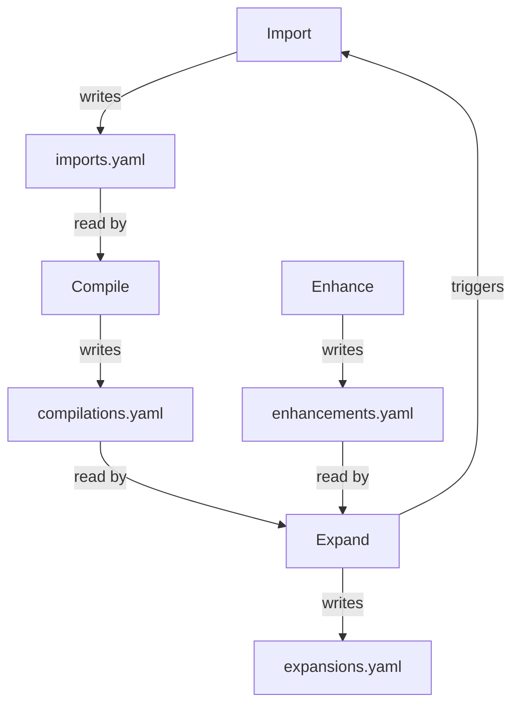

# Three-Command Pipeline

Content flows through three independent commands — Import, Compile, Expand — each owning exactly one boundary. No command crosses another's boundary.

## Context

The content pipeline started as a single "discover and write" prompt that grew into overlapping commands with confused responsibilities. Source approval happened implicitly, compilation mixed with gap-filling, and failures were hard to diagnose because multiple concerns were entangled in one operation.

The decomposition into three commands emerged from observing that the pipeline has three fundamentally different kinds of work: capturing content (mechanical), transforming content (requires understanding), and discovering gaps (requires reasoning about what's missing). Each requires different capabilities and operates on different timescales.

## Specs

- [Source-Grounded Knowledge](../specs/source-grounded-knowledge.md) — separation of capture from interpretation preserves source integrity

## Architecture

### Boundary Ownership

Each command owns one boundary:

| Command | Boundary | Intelligence Required | Timescale |
|---------|----------|----------------------|-----------|
| **Import** | Outside world → `raw/` | Trivial (format detection) | Seconds |
| **Compile** | `raw/` → `wiki/` | High (content understanding, classification, synthesis) | Minutes |
| **Expand** | Existing wiki → knowledge gaps → triggers Import | High (gap discovery, research prioritization) | Minutes to hours |

### Separation of Intelligence

Import is deliberately unintelligent. It detects content format (article, paper, video, snippet) from source metadata — MIME type, URL patterns, file extension. It does NOT read or interpret the content. This is Design Principle 3: "IMPORT detects format (trivial). COMPILE understands content (requires LLM). Classification happens at the latest responsible moment."

The consequence: a raw file arrives in `raw/articles/` without domain, topic, or type classification. Those are opinions that require understanding the content. Import preserves the source unchanged; Compile interprets it later with full context (the existing manifest, facet vocabulary, entity registry).

This separation means import can never misclassify content (it doesn't classify), and compile always has the latest vocabulary and context when it does classify.

### Composites

Three shortcuts compose the commands for common workflows:

| Composite | Expands To | Use Case |
|-----------|-----------|----------|
| `ingest <url>` | import + compile | End-to-end: fetch a URL and compile it into wiki pages |
| `ingest <url> --deep` | import + compile + expand | Full cycle: fetch, compile, then discover related gaps |
| `status` | (read-only) | Show compile queue, inbox count, KB stats |

Composites are syntactic sugar. Each underlying command runs independently and could be invoked separately.

### State Handoffs

Commands communicate through append-only YAML ledgers (see [Append-Only State Model](append-only-state.md)):

Each ledger is written by exactly one command and read by downstream commands. No ledger is shared for writes between commands — this prevents race conditions and makes the data flow unambiguous.

### Idempotency

Commands are designed to be safely re-run:

- **Import** checks `imports.yaml` for existing source URLs before fetching. Re-importing the same URL prompts: "Already imported. Re-import?"
- **Compile** derives its queue from content hashes: `raw files where SHA-256[:8] has no matching entry in compilations.yaml`. Unchanged raw files are never reprocessed.
- **Expand** compares the current manifest hash against the last run's snapshot. If the manifest hasn't changed, no new gaps to discover.

This means a crashed operation can be safely restarted. Incomplete work has no ledger entry (entries are appended AFTER side effects) and will be retried on the next run.

### What Each Command Produces

**Import produces:**
- A raw file in `raw/<type>s/<slug>-<date>-<hash8>.<ext>` (untouched source content)
- An entry in `instance/state/imports.yaml` (source URL, title, content_type, hash, timestamp)

**Compile produces:**
- One or more wiki pages in `wiki/<directory>/<slug>.md` (with full frontmatter and section structure)
- An entry in `instance/state/compilations.yaml` (raw→wiki mapping, facets, timestamp)
- Updated indexes via `build-index.py` (manifest, reverse indexes)

**Expand produces:**
- A list of knowledge gaps with scores and rationale
- New entries in `instance/state/expansions.yaml` (proposed/accepted/rejected topics)
- Import triggers for accepted gaps (feeding back into the pipeline)

## Interfaces

| Protocol | Implements | Reads | Writes |
|----------|-----------|-------|--------|
| `sprue/protocols/import.md` | Import | `imports.yaml` (dedup check) | `imports.yaml`, raw files |
| `sprue/protocols/compile.md` | Compile | `imports.yaml`, `compilations.yaml`, manifest, config | `compilations.yaml`, wiki pages, indexes |
| `sprue/protocols/expand.md` | Expand | manifest, `expansions.yaml`, `enhancements.yaml` | `expansions.yaml`, triggers Import |
| `sprue/protocols/enhance.md` | (Enhance) | manifest, wiki pages | `enhancements.yaml` (consumed by Expand) |

Supporting scripts:
- `sprue/scripts/build-index.py` — regenerates manifest and reverse indexes after Compile
- `sprue/scripts/check-config.py` — validates config before any command runs

## Decisions

- [ADR-0003: Three-Command Pipeline — Import/Compile/Expand](../decisions/0003-three-command-pipeline.md) — the core decomposition decision and alternatives rejected (single monolithic ingest, five-command pipeline)
- [ADR-0001: Origin and Scaling Vision](../decisions/0001-origin-and-scaling-vision.md) — the four-phase roadmap that motivated pipeline design
- [ADR-0008: Emergent Directory Structure](../decisions/0008-emergent-directory-structure.md) — directories emerge during Compile, not predefined
