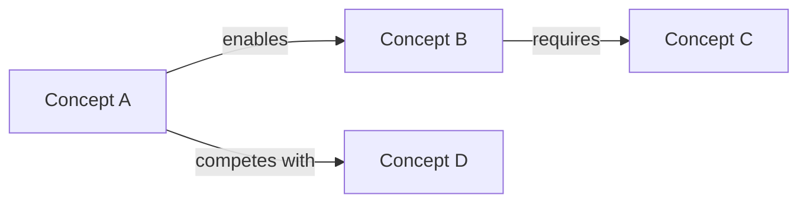

# Strategy: concept_map
# Produces a structured concept → relationship → concept map.

Analyze the source and extract a concept map: the key ideas, how they relate, and where they connect to existing knowledge.

## Output Format

```markdown
---
type: source-summary
tech: [inferred]
domain: [from {{facets}}]
concerns: [from {{facets}}]
confidence: medium
author: llm
last_verified: null
risk_tier: reference
summary: "Concept map from [source title]"
---

# [Source Title] — Concept Map

## TL;DR

[2-3 sentences]

## Concepts

| Concept | Definition | Existing Wiki Page |
|---------|------------|--------------------|
| X | one-line definition | [[page]] or *new* |

## Relationships



## Key Relationships (prose)

- **A enables B** because [explanation]
- **B requires C** because [explanation]

## Gaps Identified

Concepts from this source that the wiki doesn't cover yet.
```

Depth adjustment (values from `config.prompts.concept_map`):
- **shallow**: top `config.prompts.concept_map.shallow` concepts, diagram only
- **standard**: `config.prompts.concept_map.standard` — all concepts, diagram + prose relationships
- **deep**: `config.prompts.concept_map.deep` — all concepts, diagram, prose, plus second-order relationships

---

Source content:

{{source}}
